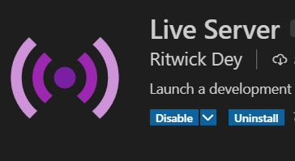

# Flushy Website

 

## Description

Welcome to our Flushy Website! This website allows users to find the nearest restrooms according
to their location. They can also click onto a specific restroom and see pictures and read reviews
about these restroom qualities. The purpose of this website is to ensure people have access
to convenient and sanitary bathrooms.

Link to website: https://flushy.netlify.app/

## Reading from Our Database (Iteration 5)

Available to you is our Google Firestore database, which is a database that stores reviews for bathrooms.
Below is a link to a repository that has a quick run-down on how to start reading from our database in your project!

Link: https://github.com/isaiahcabugos/FlushyFirebaseTutorial

## MapBox Feature (Iteration 5)

Available to you is our Mapbox Feature, which is basically a map that can be used by users to find locations to places.
Below is a link to a repository that has a demo of the map, and code showing you can implement the map, as well as guides and documentation on how to customize the map to your liking!

Link: https://github.com/le11evan/Flushy_Mapbox

## Members

Evan Le - le11evan@csu.fullerton.edu

Isaiah George - isaiahcabugos@csu.fullerton.edu

Guang Chen - kp82611@csu.fullerton.edu

Justin Bui - Justin_Bui12@csu.fullerton.edu

Luciano Gibertoni - Lgibertoni@csu.fullerton.edu

Collin Chiu - cchiu727@csu.fullerton.edu

Akanksha Shukla - 1219aks@csu.fullerton.edu

## How to Run it Locally

To run it locally, assuming you are using VS Code, you can download the Live Server
extension to run this on a local host server.

